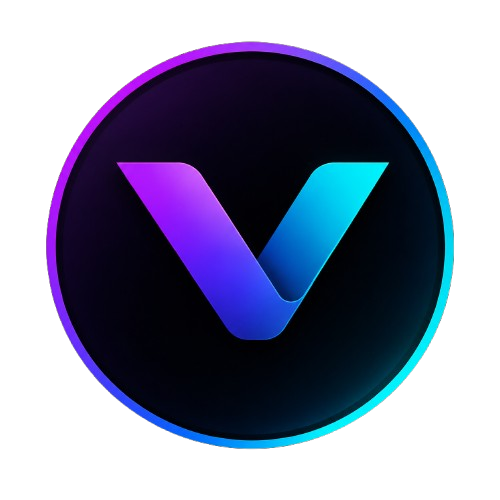

# Hi 👋 I'm **Vikas**

### Software Engineer • AI Engineer • Building **Vebee**

Building intelligent software, AI-powered products, cloud-native applications,
and modern developer experiences.

 

  

  

  

  

# 👨‍💻 About Me

<table>
<tr>

<td width="65%">

### Hello!

I'm a Software Engineer passionate about creating impactful technology.

- 💼 Software Engineer @ **HCLTech**
- 🚀 Founder of **Vebee**
- 🤖 Interested in Artificial Intelligence
- ☁ Learning Cloud Technologies
- 💻 Full Stack Developer
- 🧠 Exploring LLMs & AI Agents
- 🌱 Open Source Enthusiast

### Currently

- 🔭 Building **Vebee**
- 📚 Learning Advanced AI
- ⚡ Creating Modern Software
- 🎯 Growing as an Engineer

</td>

<td align="center">

</td>

</tr>
</table>

---

# ⚡ Tech Stack

# 📊 GitHub Analytics

  
  

  

---

# 📈 Contribution Graph

# 🚀 Featured Projects

<table>

<tr>

<td width="50%">

## 🧠 MindScope AI

AI-powered Mental Health Analytics Platform

**Tech**

- React
- FastAPI
- Python
- MongoDB
- Machine Learning

</td>

<td width="50%">

## 🚀 Vebee

Building AI-powered products, cloud-native applications, and modern software experiences.

</td>

</tr>

<tr>

<td>

## 🏦 Banking System

Full Stack Banking Application

- React
- FastAPI
- MongoDB

</td>

<td>

## 🌾 Wheat Disease Detection

Deep Learning based Crop Disease Detection using CNN architectures.

</td>

</tr>

<tr>

<td>

## 📹 CCTV Anomaly Detection

Final Year Project

Deep Learning

Computer Vision

</td>

<td>

## 🤖 Enterprise AI Assistant

RAG

OpenAI

LangChain

Docker

</td>

</tr>

</table>

---

# 🏅 Certifications & Achievements

- 🏆 AWS Certified Cloud Practitioner
- 🏆 AWS Certified AI Practitioner
- 📄 IEEE Research Publication
- 💼 Software Engineer @ HCLTech
- 🎓 B.Tech CSE (AI & ML)

---

# 📬 Connect With Me

 

  

## ⭐ Building the Future with AI

*"Turning ideas into intelligent products."*

Thanks for visiting my profile! If you like my work, consider ⭐ starring my repositories.

